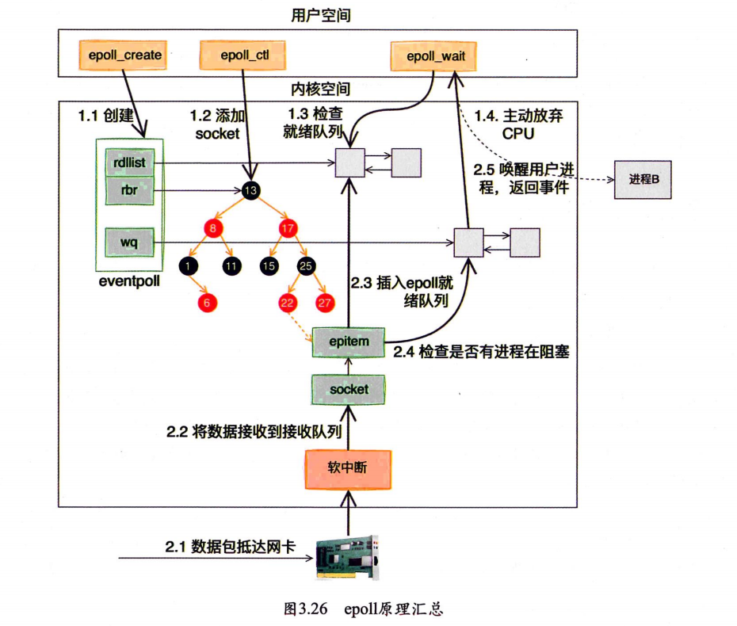
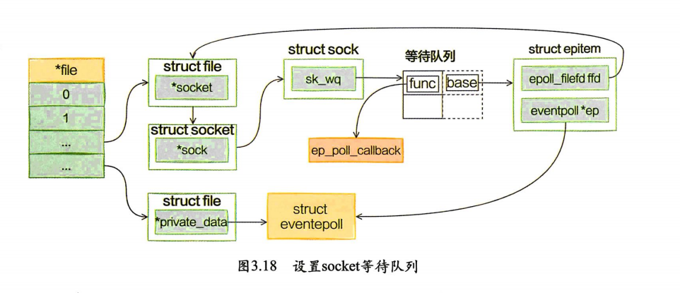
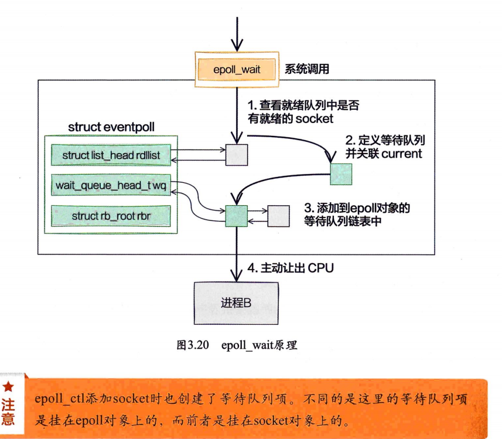
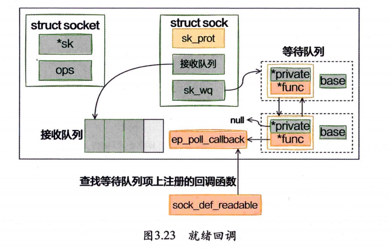
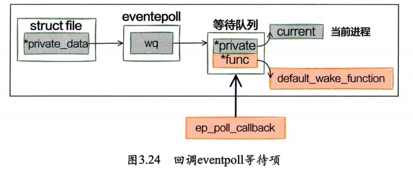
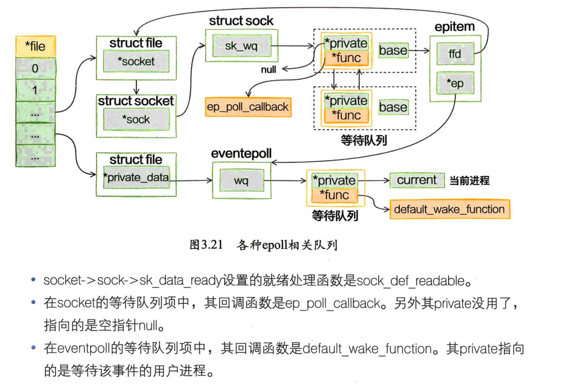

# Epoll_Src_Study
对epoll源码的详细分析,并给出epoll流程图
并结合源码详细分析LT与ET触发模式,epoll的惊群现象

## 1.在深入了解epoll的实现之前, 先来了解内核的4个方面.
### 1. 等待队列 waitqueue
 我们简单解释一下等待队列:队列头(wait_queue_head_t)往往是资源生产者,队列成员(wait_queue_t)往往是资源消费者,当头的资源ready后, 会逐个执行每个成员指定的回调函数,来通知它们资源已经ready了, 等待队列大致就这个意思.
 ### 2. 内核的poll机制
 被Poll的fd, 必须在实现上支持内核的Poll技术,比如fd是某个字符设备,或者是个socket, 它必须实现file_operations中的poll操作, 给自己分配有一个等待队列头.主动poll fd的某个进程必须分配一个等待队列成员, 添加到fd的对待队列里面去, 并指定资源ready时的回调函数.用socket做例子, 它必须有实现一个poll操作, 这个Poll是发起轮询的代码必须主动调用的, 该函数中必须调用poll_wait(),poll_wait会将发起者作为等待队列成员加入到socket的等待队列中去.这样socket发生状态变化时可以通过队列头逐个通知所有关心它的进程.这一点必须很清楚的理解, 否则会想不明白epoll是如何得知fd的状态发生变化的.
 ### 3. epollfd本身也是个fd, 所以它本身也可以被epoll,
 可以猜测一下它是不是可以无限嵌套epoll下去...  epoll基本上就是使用了上面的1,2点来完成.可见epoll本身并没有给内核引入什么特别复杂或者高深的技术,只不过是已有功能的重新组合, 达到了超过select的效果.
 ### 4.相关的其它内核知识:
 1. fd我们知道是文件描述符, 在内核态, 与之对应的是struct file结构,可以看作是内核态的文件描述符.
 2. spinlock, 自旋锁, 必须要非常小心使用的锁,尤其是调用spin_lock_irqsave()的时候, 中断关闭, 不会发生进程调度,被保护的资源其它CPU也无法访问. 这个锁是很强力的, 所以只能锁一些非常轻量级的操作.
 3. 引用计数在内核中是非常重要的概念,内核代码里面经常有些release, free释放资源的函数几乎不加任何锁,这是因为这些函数往往是在对象的引用计数变成0时被调用,既然没有进程在使用在这些对象, 自然也不需要加锁.struct file 是持有引用计数的.
 ## 2.epoll的各个组件关系图与流程图
 ### 1.epoll原理汇总
 
 ### 2.epoll_ctl添加节点的过程
 
 ### 3.epoll_wait挂起
 
 ### 4.网络数据包到来
 
 
 ### 5.区分两个等待队列
 
 ## 作者
Author: California-817
QQ: 1876439531
QQ邮箱: 1876439531@qq.com

